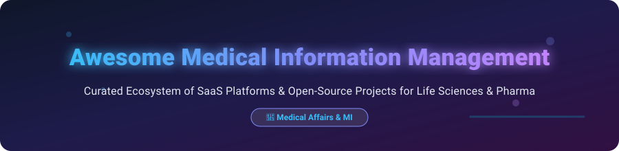

  

# 🏥 Awesome Medical Information Management

  
  
  
  
  

> 📚 **A curated ecosystem of top SaaS platforms and open-source software for pharmaceutical Medical Information (MI), Healthcare Professional (HCP) inquiry handling, medical affairs workflows, and GxP regulatory compliance.**

---

## 💡 Overview & Market Insights

The global **Medical Information (MI) Management Software** market is valued at approximately **~$3.1 Billion USD** and is projected to expand to over **$6.0 Billion USD by 2034** (CAGR of ~7.4%). 

The sector is **moderately concentrated with enterprise market leaders**, dominated by key commercial platforms like **IQVIA** and **Veeva Systems**, while remaining **fragmented across specialized niche providers and regional intake tools**. Due to strict FDA, EMA, and GxP regulatory requirements, global pharmaceutical enterprises predominantly rely on validated SaaS solutions as their primary system of record for HCP scientific responses and inquiry handling.

---

## 📋 Table of Contents

- [☁️ SaaS & Enterprise Platforms](#️-saas--enterprise-platforms)
- [🔓 Open-Source GitHub Projects](#-open-source-github-projects)
- [💖 Support](#-support)
- [🤝 How to Contribute](#-how-to-contribute)
- [⚠️ Disclaimer](#️-disclaimer)
- [📈 Star History](#-star-history)

---

## 💖 Support

Thank you for visiting this repository! If you find this curated list helpful for your medical affairs, life-sciences compliance, or software research, please consider supporting the project:

- ⭐ **Star** this repository on GitHub to help others discover it.
- 🍴 **Fork** it to keep your own copy or contribute new entries.
- 📢 **Share** it with colleagues, medical info specialists, and developers.
- ☕ **Buy a Coffee / Sponsor**: If you'd like to support ongoing open-source curation and development, consider sponsoring via the [GitHub Sponsor Dashboard](https://github.com/sponsors/ishandutta2007).

---

## ☁️ SaaS & Enterprise Platforms

Below is a curated summary of commercial SaaS platforms for global Medical Information (MI), inquiry management, and scientific communications, sorted by **Company Size (Revenue / Market Cap)** in descending order.

| 🏢 Platform / Product | 📝 Description & Focus | 💰 Company Size (Revenue / Valuation) | 💵 Starting Tier Pricing | 🎁 Free Tier / Trial Limits |
| :--- | :--- | :--- | :--- | :--- |
| **[IQVIA Medical Information](https://www.iqvia.com/)** (inc. DrugDev) | Comprehensive end-to-end MI contact center, inquiry management, and clinical/medical affairs technology suite. | **~$16.3B Annual Revenue** (~$44B Market Cap) | Enterprise custom quote (Contact Sales for enterprise deployment) | No free tier; 30-day proof-of-concept sandbox demo upon sales approval |
| **[Veeva MedInquiry](https://www.veeva.com/)** | Industry-leading cloud solution for global MI inquiry handling, case intake, and approved content management within Veeva Vault. | **~$3.2B Annual Revenue** (~$42B Market Cap) | Enterprise licensing starting at ~$150,000/year base platform fee | No free trial or free tier; dedicated guided demo available upon request |
| **[ArisGlobal LifeSphere MI](https://www.arisglobal.com/)** | AI-driven life sciences platform unifying medical inquiries, safety/pharmacovigilance, and medical affairs workflows. | **~$200M Annual Revenue** (~$1.5B Valuation) | Enterprise quote based on user seats and inquiry volume | No free tier; 14-day guided enterprise trial for qualified pharma organizations |
| **[MasterControl MI Solutions](https://www.mastercontrol.com/)** | Quality and compliance management software extended for controlled medical information documents and GxP audit trails. | **~$150M Annual Revenue** (~$1.3B Valuation) | Standard packages starting from ~$25,000/year | No free tier; request-based interactive sandbox environment demo |
| **[EXTEDO MI Solutions](https://www.extedo.com/)** | Regulatory affairs and medical information management software supporting compliant scientific communication. | **~$30M Annual Revenue** (~$150M Valuation) | Modular SaaS licensing from ~$15,000/year | No free tier; 30-day trial available upon partner evaluation request |
| **[Ennov Medical Information](https://www.ennov.com/)** | Unified life-sciences suite covering medical inquiries, document management, and regulatory compliance. | **~$25M Annual Revenue** (~$120M Valuation) | Suite licensing starting at ~$12,000/year | No free tier; standard 14-day test environment for prospective clients |
| **[Within3](https://www.within3.com/)** | Insights management and medical affairs engagement platform for scientific exchange and HCP communications. | **~$20M Annual Revenue** (~$100M Valuation) | Project/advisory tier packages starting from ~$10,000/engagement | No free tier; custom interactive product demonstration |
| **[PharmaForce IQ](https://www.pharmaforceiq.com/)** | Specialized medical affairs contact center platform for inquiry intake, content routing, and response tracking. | **~$10M Annual Revenue** (~$50M Valuation) | Mid-market packages starting at ~$1,000/user/month | No free tier; 14-day trial period upon agreement |
| **[True Blue MI](https://www.truebluemi.com/)** | Dedicated life-sciences software tailored for medical inquiry documentation, HCP responses, and reporting. | **~$5M Annual Revenue** (~$25M Valuation) | Specialized plans starting from ~$800/user/month | No free tier; 30-day trial environment provided post-consultation |

---

## 🔓 Open-Source GitHub Projects

While validated end-to-end MI platforms for regulated pharma are commercial, several high-quality open-source projects provide key infrastructure, EHR capabilities, workflow management, and service desk intake.

The projects below are sorted by **GitHub Stars (Descending)**. Click on any star badge to visit the stargazers page for that repository!

| 📦 Repository & Project | 🌟 GitHub Stars | 🏷️ Category & Description |
| :--- | :--- | :--- |
| **[odoo/odoo](https://github.com/odoo/odoo)** |  | **Open ERP & Healthcare** • Flexible open-source ERP with custom medical records, ticketing, and document management modules. |
| **[frappe/erpnext](https://github.com/frappe/erpnext)** |  | **ERP & Healthcare Modules** • Full-featured open-source ERP with built-in healthcare, quality management, and inquiry handling capabilities. |
| **[zammad/zammad](https://github.com/zammad/zammad)** |  | **Customer Support & Ticketing** • Web-based open-source support system ideal for building custom HCP medical inquiry intake channels. |
| **[openemr/openemr](https://github.com/openemr/openemr)** |  | **Electronic Health Records** • ONC-certified open-source EHR system for tracking medical communications and patient/HCP interactions. |
| **[camunda/camunda-bpm-platform](https://github.com/camunda/camunda-bpm-platform)** |  | **Workflow & Approval Engine** • Open-source BPMN engine to automate approval workflows for medical content and scientific responses. |
| **[TheHive-Project/TheHive](https://github.com/TheHive-Project/TheHive)** |  | **Security & Incident Case Management** • Scalable open-source case management system adaptable for audit logging and inquiry routing. |
| **[osTicket/osTicket](https://github.com/osTicket/osTicket)** |  | **Support Ticketing System** • Widely deployed open-source support ticket engine for structured form-based inquiry intake. |
| **[medplum/medplum](https://github.com/medplum/medplum)** |  | **Headless FHIR Platform** • Open-source developer platform for building compliant healthcare applications and data pipelines. |

---

## 🤝 How to Contribute

Contributions are welcome! Help us keep this list comprehensive, updated, and useful for the life sciences community.

1. 🍴 **Fork** the repository.
2. 📝 **Add or edit** entries in `README.md` following the table formats above.
3. 🔎 Ensure all company figures, links, and project descriptions are factual.
4. 🔀 **Submit a Pull Request** with a clear title and description.

---

## ⚠️ Disclaimer

- This repository is a **community-curated informational list** and does not constitute endorsement or commercial representation.
- **Regulatory Warning**: Medical Information management within the pharmaceutical and biotech industries is governed by strict regulatory bodies (e.g., US FDA, EMA, MHRA). Standard open-source ticketing or generic EHR systems are **not** GxP-validated out of the box and should not serve as the primary system of record without comprehensive software validation, electronic signature controls (21 CFR Part 11), and regulatory auditing.

---

## 📈 Star History

---

  Made with ❤️ for Medical Information, Medical Affairs, and Life-Sciences Compliance Teams.

